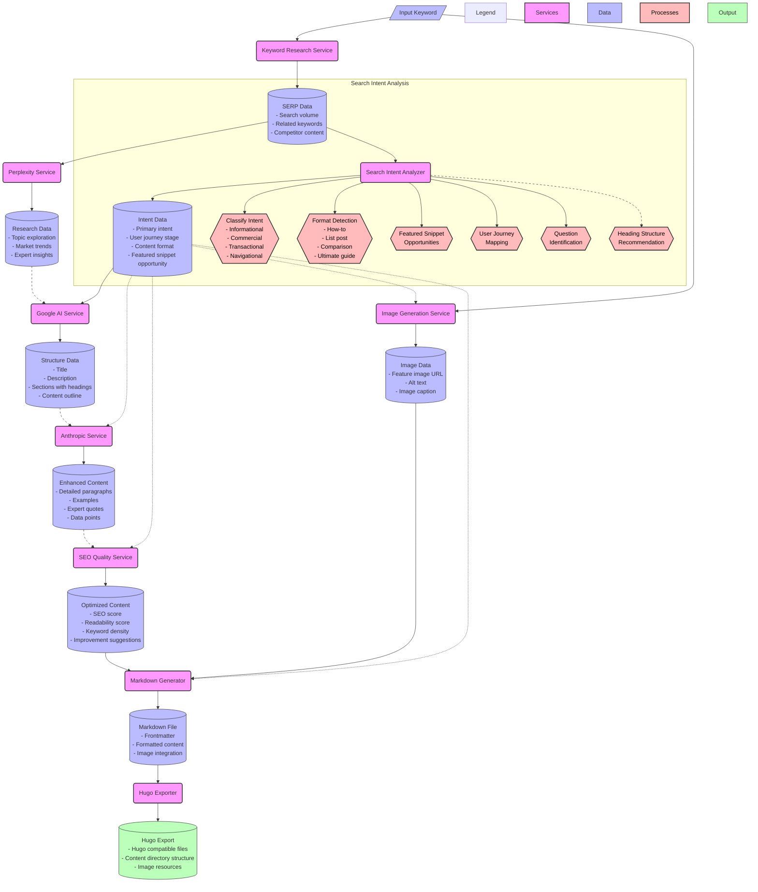

# WP2HUGO Content Generation Process Flow

The diagram below illustrates the complete process flow of how a keyword is transformed into high-quality content with the WP2HUGO system.

## Diagram Explanation

The diagram shows the complete transformation process of a keyword into high-quality content:

1. **Input**: The process begins with a user-provided keyword.

2. **Research Phase**:
   - The keyword is sent to the Keyword Research Service.
   - SERP data is collected (search volume, related keywords, competitor content).
   - The Perplexity Service gathers additional research data.

3. **Search Intent Analysis**:
   - The new Search Intent Analyzer processes the keyword and SERP data.
   - It determines the primary intent (informational, commercial, transactional, navigational).
   - It identifies ideal content formats, featured snippet opportunities, and maps the user journey.
   - It generates a comprehensive intent data package.

4. **Content Structure Generation**:
   - The Google AI Service uses research data and intent data to create a structured content outline.
   - This includes title, description, headings, and content sections aligned with the detected intent.

5. **Content Enhancement**:
   - The Anthropic Service enhances the structure with detailed paragraphs and examples.
   - Intent data influences the enhancement process for better alignment with user needs.

6. **SEO Optimization**:
   - The SEO Quality Service evaluates and optimizes the content.
   - It generates SEO scores, readability metrics, and improvement suggestions.

7. **Image Generation**:
   - An image is generated based on the keyword, influenced by intent data.
   - This process produces an image URL, alt text, and caption.

8. **Markdown Generation**:
   - The optimized content and image data are compiled into a markdown file.
   - Intent data influences the formatting and presentation.

9. **Hugo Export**:
   - The markdown file is exported in a Hugo-compatible format.
   - The final output includes content files, directory structure, and image resources.

The dotted lines indicate how the intent data influences multiple stages of the process, showing the central role of search intent analysis in creating content that matches user needs. 